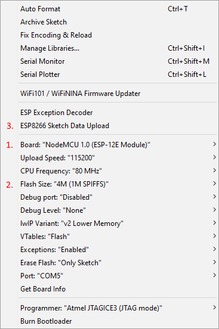

# Moodlite


## Table of Contents
- [Prerequisites](#prerequisites)
- [Usage](#usage)
- [Coding Standards and Naming Conventions](#coding-standards-and-naming-conventions)
- [Credits](#credits)
- [Change log](#change-log)
- [Authors](#authors)
- [License](#license)
- [Support us](#support-us)
- [Links](#links)

## Prerequisites

```
Arduino based on ESP8266 
Arduino IDE (1.8.8 and higher)
Arduino libraries
```

## Usage
### Timezone
For your time zone, you need to modify Timezone part of the code. [See](https://github.com/JChristensen/Timezone) for details.
```
// Central European Time (Frankfurt, Paris)
// Central European Summer Time
TimeChangeRule tchrCest = { "CEST", Last, Sun, Mar, 2, 120 };
// Central European Standard Time
TimeChangeRule tchrCet = { "CET", Last, Sun, Oct, 3, 60 };
```
### SPIFFS
#### Install SPIFFS
To install SPIFFS support follow [procedure](https://arduino-esp8266.readthedocs.io/en/latest/filesystem.html#uploading-files-to-file-system)
#### Upload SPIFFS data
To upload SPIFFS data to Arduino you need to have "data" folder in the same folder as "Moodlite.ino" file.
Then follow the same procedure as shown in the picture:



## Coding Standards and Naming Conventions
Base rules are described in [naming conventions file](Arduino/Naming_convention.txt)
	
## Credits
This software uses the following open source packages:
* [ESPAsyncWebServer](https://github.com/me-no-dev/ESPAsyncWebServer) - Async HTTP and WebSocket Server for ESP8266 Arduino
* [ESPAsyncTCP](https://github.com/me-no-dev/ESPAsyncTCP) - Async TCP Library for ESP8266 Arduino
* [Timezone](https://github.com/JChristensen/Timezone  ) - Arduino Timezone Library

## Change log

See the [CHANGELOG.md](CHANGELOG.md) file for details.

## Authors

* **Steve Wagg** - *Initial work* - [CdRsKuLL](https://github.com/...)
* **M.V.** - [Spigot](https://github.com/spigotx)

## License

This project is licensed under the GNU V3 License - see the [LICENSE.md](LICENSE.md) file for details.

## Support us

Wether you use this project, have learned something from it, or just like it, please consider supporting us on our web site. :)

## Links

* [Web site](http://moodlite.co.uk)
